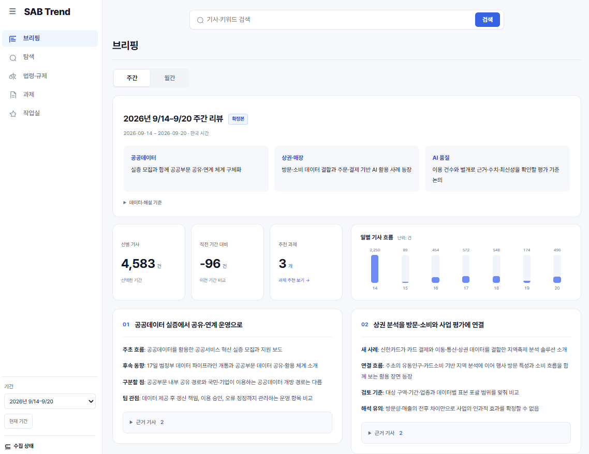
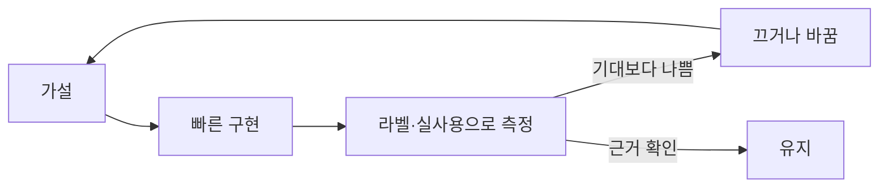
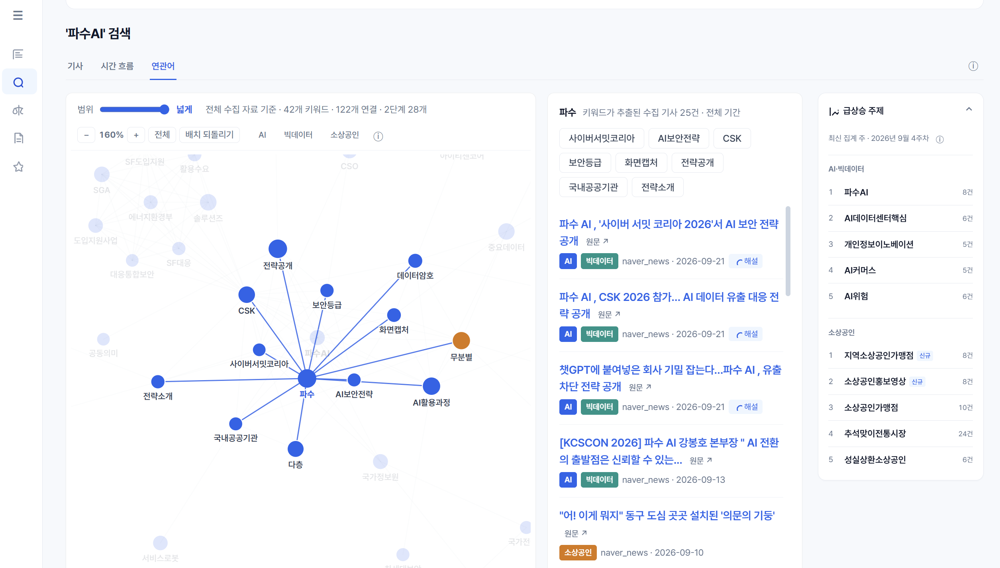
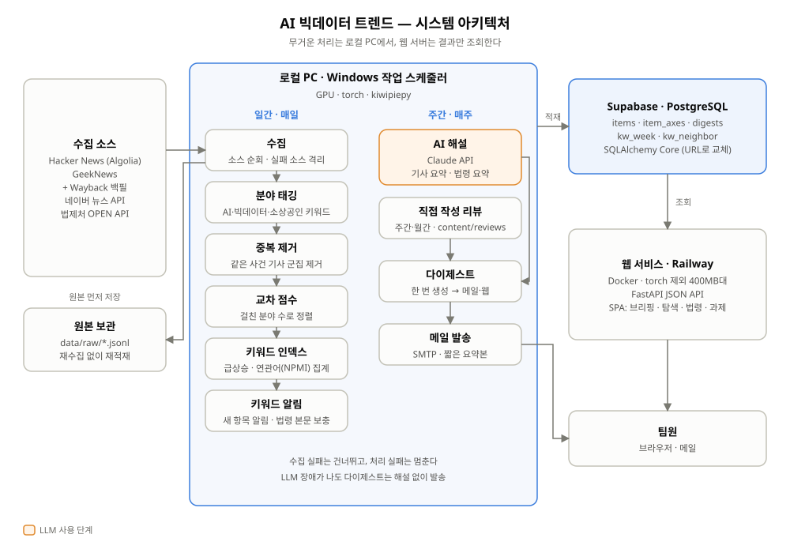

# AI 빅데이터 트렌드 (SAB Trend)

**사내 AI·빅데이터팀이 매주 기사를 거르는 데 쓰던 시간을 없애기 위해 만든 트렌드 브리핑 도구**

AI · 빅데이터 · 소상공인 세 분야 기사를 매일 모으고, 세 분야에 동시에 걸치는 기사일수록 위에 올려 주간 브리핑으로 보여줍니다.
만든 기능 중 절반 가까이는 **라벨 데이터와 실제 사용 결과를 보고 끄거나 바꿨습니다.** 그 과정을 아래에 기록했습니다.



| 누적 기사 | 수집 소스 | 사람 라벨 검증 | 배포 |
|:---:|:---:|:---:|:---:|
| **82,000건+** | Hacker News · GeekNews · 네이버 뉴스 · 법제처 | 50건 (정밀도·재현율) | Railway + Supabase |

---

## 문제

- 팀의 실제 업무는 **"AI 기술" · "빅데이터" · "소상공인 정책"이 겹치는 지점**에 있다.
- 그런데 기사는 분야별로 따로 나오고, 팀원은 매주 관련 없는 기사를 직접 걸러내고 있었다.
- 네이버 뉴스 API는 검색어당 최근 1,000건까지만 조회되므로, **그날 수집하지 않은 기사는 다시 받을 수 없다.**

→ 목표: 매일 자동으로 수집하고, **세 분야가 겹치는 기사를 맨 위에** 보여준다.
성공 기준은 필터 성능 수치가 아니라 **팀원이 브리핑을 실제로 읽는지**로 잡았다.

## 가설 → 검증 → 결정

| # | 가설 | 검증 방법 | 결과 | 결정 |
|---|---|---|---|---|
| 1 | 임베딩 유사도로 관련 기사를 걸러낼 수 있다 | 사람이 라벨을 붙인 50건으로 측정 | 정밀도/재현율 임베딩 **0.56 / 0.52**, 분야 키워드 매칭 **0.61 / 0.96** | **임베딩 필터를 끔.** 사람이 나눈 기준은 주제가 아니라 기사 성격(기관·정책 vs 개인 개발 도구)이었고, 문장 임베딩으로는 이 차이를 구분하지 못함 |
| 2 | 임베딩을 껐으니 중복 제거도 필요 없다 | 중복 제거를 끄고 급상승 순위 확인 | 급상승 **1~5위가 모두 같은 사건** (기사 50건) | **중복 제거는 유지** |
| 3 | LLM 분류기가 필터 역할을 더 잘할 것이다 | Haiku 2중 교차검증 | 0.76 / **0.53** (관련 기사 절반을 놓침) | **보류.** 라벨 200~300건을 먼저 확보하기로 함 |
| 4 | 세 분야를 잇는 "브릿지 키워드"가 과제 후보가 된다 | 실제 상위 키워드 확인 | '유치·메뉴·파일·최저·언어' | **화면에서 제거.** 흔한 단어일수록 여러 분야에 나오므로 점수가 사실상 "일반적인 단어" 점수가 됨. 임계값으로 고칠 수 있는 문제가 아니었음 |
| 5 | AI 해설은 기사마다 "왜 중요한가"를 알려줘야 한다 | 팀원 실사용 피드백 | 기사를 읽기 전에 의미부터 들으면 따라가기 어려움 | **해설을 기사 요약으로 바꿈** |



## AI를 쓰는 원칙

- **모든 AI 해설에 근거 기사 링크를 붙인다.** 환각이 한 번만 나와도 팀의 신뢰를 잃는다.
- **AI는 설명까지만 하고, 판단은 사람이 한다.** "도입해야 한다" 같은 결론은 AI가 내지 않는다.
- **LLM 장애가 나도 브리핑은 발송한다.** 해설만 빠진 상태로 내보낸다.
- 비용이 드는 해설은 주 1회, 다시 받을 수 없는 수집은 매일 돌린다.

## 화면

| 탐색 · 연관어 | |
|---|---|
|  | 검색할 때마다 **그 키워드 주변의 연관어만** 계산한다. 전체 지도를 400개 노드로 압축하면 흔한 단어가 상위를 차지해서 어떤 주제에도 맞지 않는 그림이 됐다. 이렇게 바꾸니 계산 비용도 줄었다. |

## 아키텍처



- **무거운 처리는 로컬 PC에서, 웹 서버는 결과만 보여준다.** 서버 이미지에서 torch를 빼서 3GB에서 400MB대로 줄였다.
- 키워드 인덱스를 만들 때 최대 메모리가 924MB여서 작은 인스턴스에서는 OOM으로 죽었다. 데이터를 배치로 나눠 처리하도록 바꿔 **726MB**로 낮췄다.
- DB 접근은 SQLAlchemy Core로만 한다. `DATABASE_URL` 한 줄만 바꾸면 SQLite에서 Postgres로 옮길 수 있다.
- 크롤링할 때는 제목·요약·링크만 저장하고, `robots.txt`와 403/429 응답을 우회하지 않는다.

## 기술 스택

`Python` · `FastAPI` · `SQLAlchemy` · `Supabase (Postgres)` · `kiwipiepy` · `sentence-transformers` · `Claude API` · `Vanilla JS` · `Docker` · `Railway`

## 실행

```bash
git clone https://github.com/wjdgnsdl213/AI_tech_radar.git && cd AI_tech_radar
pip install -r requirements-web.txt
cp .env.example .env          # DATABASE_URL
python -m uvicorn web.server:app --port 8000
```

파이프라인·배포·환경변수 설명은 [`docs/OPERATIONS.md`](docs/OPERATIONS.md)에, 기획 근거는 [`PLAN.md`](PLAN.md)에, 판단 기록은 [`HANDOFF.md`](HANDOFF.md)에 있습니다.

> 먼저 만든 [sobiz-trend-radar](https://github.com/wjdgnsdl213/sobiz-trend-radar)에서 검증을 거친 자산(네이버 수집기, 누적 DB, FastAPI 웹)을 가져와 다른 사용자와 목적에 맞게 다시 설계한 프로젝트입니다.
